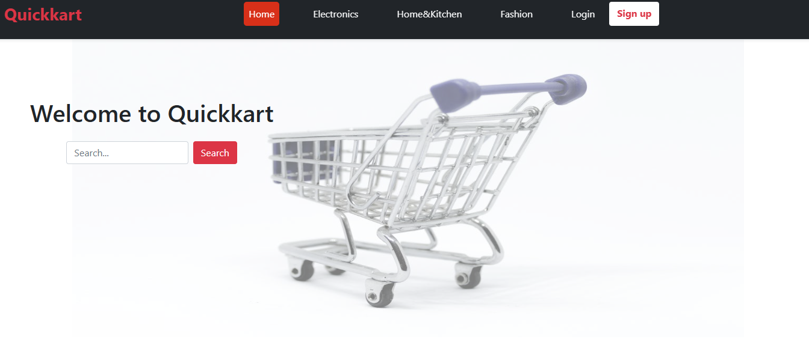
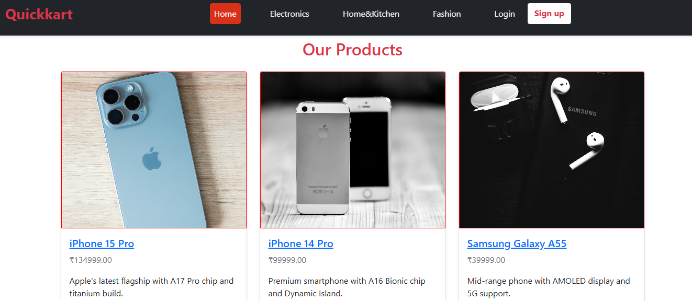
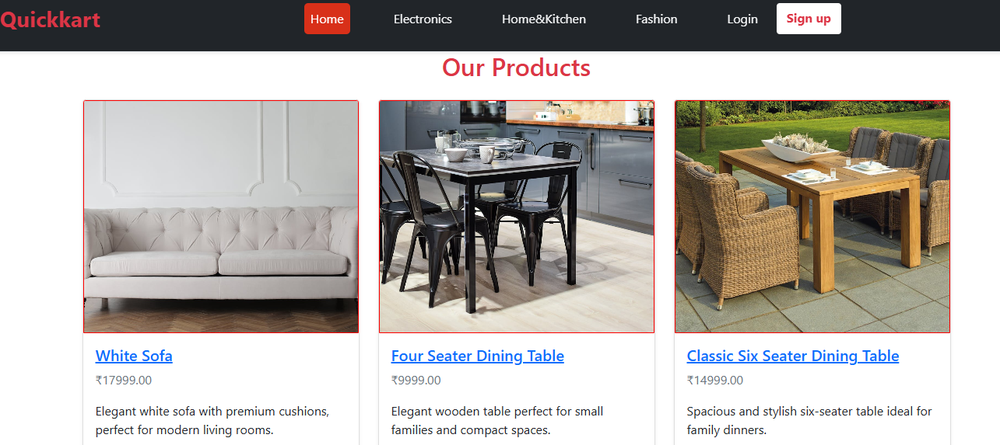
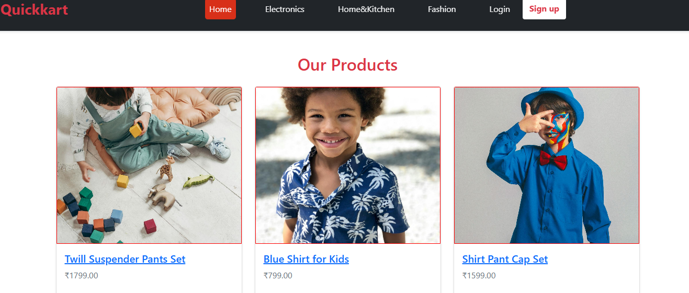
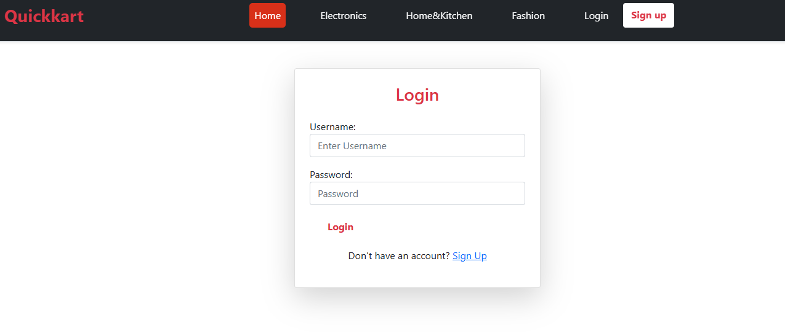
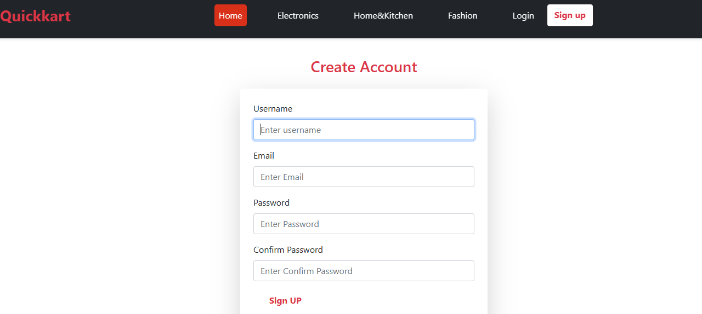
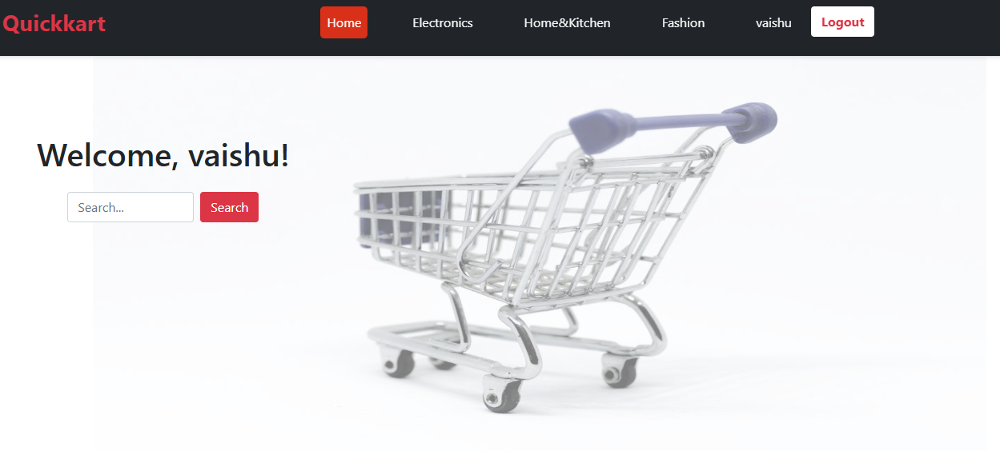

# Quickart-Ecommerce

Quickkart is a Ecommerce website built with **Django**.  
It’s designed to create account,login,wishlist,cart and show all the products such as **Electronics,Fashion,Home & Kitchen**.

---

##  Features
- User-friendly navigation bar
- Category-wise Products 
- Admin panel for managing categories and products
- Responsive design for all devices
- Future: AI chatbot regarding customer queries,Payment process.

---

##  Tech Stack
- **Backend:** Django, Python
- **Frontend:** HTML, CSS, Bootstrap
- **Database:** SQLite 
- **Version Control:** Git & GitHub

---

##  Project Structure

Django-Quickkart-Project
| - home #app
| - products  #app
| - ecommerce # main project
| - users    #app
| - media   # products/all the images
| - static # css/style.css
           # images/homepage.jpg
| -templates # auth/login.html,signup.html
             # base.html
             # cart.html
             # category_products.html
             # change_nav.html
             # home.html
             # product_detail.html
             # wishlist.html
| - db.sqlite3
| - manage.py
| - README.md

##  virtual enviroment

   virtual environment name - env
   activate the environment - env/scripts/activate
   change directory - cd ecommerce
   Run server command - python manage.py runserver
   Migrations command - python manage.py makemigrations
                        python manage.py migrate

## ScreenShots

#Home-Page 

#Categories
   | - Electronics
   | - Home&Kitchen
   | - Fashion

#Login
 

#Sign Up

#After Create Account and Login

